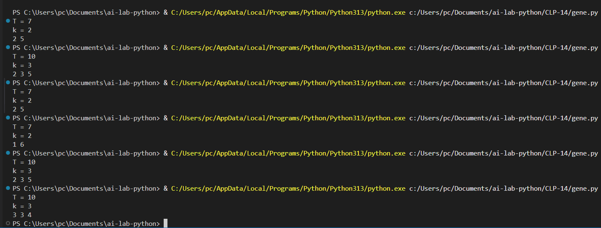

On this program used a Genetic Algorithm to evolve a list of numbers between **1 and 9** such that:

- The list has exactly `k` numbers.
- The **sum** of the list equals a given **target** value `T`.
- Among all possible solutions, the list will **prioritize smaller numbers** and **more balanced distributions** (e.g., `[3, 3, 4]` is preferred over `[8, 1, 1]`).

---

## How It Works

1. **Population Initialization:**
   - Randomly generates a population of individuals (lists), each with `k` numbers between **1 and 9**.
   - No zero is allowed.

2. **Fitness Calculation:**
   - Fitness is calculated based on:
     - **Matching the sum** exactly to the target `T` (must match or heavy penalty).
     - **Smaller maximum number** in the list (prefer lower numbers).
     - **Smaller spread** (difference between largest and smallest number).
     - **Smaller average value**.
   - The fitness function ensures that:
     - Solutions with **lower individual numbers** are prioritized.
     - **Balanced** combinations (closer numbers) are selected.

3. **Selection:**
   - The two fittest individuals are selected based on their fitness scores.

4. **Crossover:**
   - New individuals (children) are created by combining parts of two parents.

5. **Mutation:**
   - Each gene (number) has a 30% chance of mutation to introduce new values (between 1 and 9).

6. **Evolution:**
   - Over multiple generations, the population evolves towards the best minimized solution.

7. **Termination:**
   - The program stops when:
     - An individual exactly matches the target sum.
     - No zero is present in the list.

8. **Output:**
   - The program prints the best individual **sorted in ascending order** as space-separated numbers.

## Example

